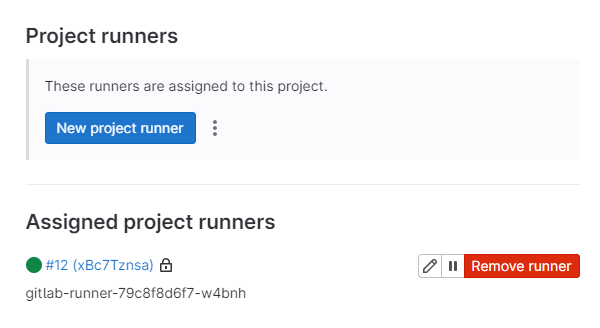

# k3s-gitlab-ci-test

## 使用 Helm 部署 GitLab Runner

> 参考：https://docs.gitlab.com/runner/install/kubernetes.html

1、添加仓库

```shell
# k3s 中使用 helm 需要先 export
export KUBECONFIG=/etc/rancher/k3s/k3s.yaml

helm repo add gitlab https://charts.gitlab.io

helm repo update gitlab

helm search repo -l gitlab/gitlab-runner # 尽量和 gitlab app 版本对应
```

2、拉取 helm release

```shell
helm pull gitlab/gitlab-runner
```

3、编辑 `values.yaml`，主要编辑三个配置：

* gitlabUrl
* runnerToken
* rbac

其中 rbac 配置可以参考：[_Configure runner API permissions_](https://docs.gitlab.com/runner/executors/kubernetes.html#configure-runner-api-permissions)。在写这篇文章的时候使用的 gitlab 版本是 v16.1.1，rbac 配置内容大概如下：
```yaml
rbac:
  create: true
  rules:
    - apiGroups: [""]
      resources: ["pods/exec"]
      verbs: ["create", "patch", "delete"]
    - apiGroups: [""]
      resources: ["pods/attach"]
      verbs: ["create", "patch", "delete"]
    - apiGroups: [""]
      resources: ["pods"]
      verbs: ["get", "list", "watch", "create", "patch", "delete"]
    - apiGroups: [""]
      resources: ["services"]
      verbs: ["get", "list", "watch", "create", "patch", "delete"]
    - apiGroups: [""]
      resources: ["secrets"]
      verbs: ["get", "list", "watch", "create", "update", "patch", "delete"]
```

4、安装 gitlab-runner
```shell
kubectl create namespace cicd
helm install gitlab-runner --namespace=cicd -f values.yaml gitlab/gitlab-runner
```

5、部署成功后刷新 runner 配置页面



6、配置成功后检查流水线状态。

## 踩坑

> 是的，又踩坑了。

使用 docker-in-docker，配置如下：

```yaml
build-image-job:
  stage: build
  image: docker:latest
  services:
    - docker:dind
```

1、报错：_ERROR: Cannot connect to the Docker daemon at unix:///var/run/docker.sock._

1.1、在宿主机安装 Docker

1.2、需要将 `values.yaml` 修改成：

```yaml
runners:
  # runner configuration, where the multi line strings is evaluated as
  # template so you can specify helm values inside of it.
  #
  # tpl: https://helm.sh/docs/howto/charts_tips_and_tricks/#using-the-tpl-function
  # runner configuration: https://docs.gitlab.com/runner/configuration/advanced-configuration.html
  config: |
    [[runners]]
      [runners.kubernetes]
        namespace = "{{.Release.Namespace}}"
        image = "ubuntu:22.04"
        [[runners.kubernetes.volumes.host_path]] # 宿主机安装好 docker 之后，添加这部分内容
          name = "docker"
          mount_path = "/var/run/docker.sock"
          host_path = "/var/run/docker.sock"
        privileged = true
```

1.3、重启服务


2、提示：`buildx: git was not found`，只需要更换镜像即可：

```yml
build-image-job:
  stage: build
  image: docker:24.0.6-git
```


## 参考

* helm 安装 gitlab-runner：https://docs.gitlab.com/runner/install/kubernetes.html
* gitlab-runner k8s 配置：https://docs.gitlab.com/runner/executors/kubernetes.html
* k3s-gitlab-ci：https://gitlab.com/gitlab-org/cluster-integration/test-utils/k3s-gitlab-ci/-/tree/master
* gitlab-ci 和 k8s 结合：https://www.qikqiak.com/post/gitlab-ci-k8s-cluster-feature/
* k8s 使用 gitlab-ci：https://help.aliyun.com/zh/ack/ack-managed-and-ack-dedicated/user-guide/use-gitlab-ci-to-run-a-gitlab-runner-and-run-a-pipeline-on-kubernetes
* k3s 运行 gitlab-runner：https://xie.infoq.cn/article/1c0bf9e4084af5230e35b9308